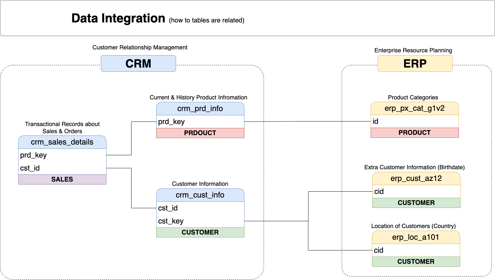

# Data Warehouse and Analytics Project

Welcome to the **Data Warehouse and Analytics Project** repository! 🚀  
This project demonstrates a comprehensive data warehousing and analytics solution, from building a data warehouse to generating actionable insights. Designed as a portfolio project, it highlights industry best practices in data engineering and analytics.

---
## 📖 Project Overview

This project involves:

1. **[Data Architecture](#-data-architecture)**: Designing a modern data warehouse using Medallion Architecture (**Bronze**, **Silver**, **Gold**).
2. **[ETL Pipelines](#-etl-pipeline-overview)**: Extracting, transforming, and loading data from source systems into the warehouse.
3. **[Data Modeling](#-data-modeling)**: Developing fact and dimension tables using star schema optimized for analytical queries.
4. **[Project Management](#-project-management)**: Structure and manage the projects step by step in an organized and scalable manner.

---
## 🏗️ Data Architecture

The data architecture for this project follows Medallion Architecture **Bronze**, **Silver**, and **Gold** layers:


1. **Bronze Layer**: Stores raw data as-is from the source systems. Data is ingested from CSV Files into SQL Server Database.
2. **Silver Layer**: This layer includes data cleansing, standardization, and normalization processes to prepare data for analysis.
3. **Gold Layer**: Houses business-ready data modeled into a star schema required for reporting and analytics.
 
## 🔁 ETL Pipeline Overview

This project follows a layered **ETL pipeline** that transforms raw CRM and ERP data into analytical insights. The process uses `plpgsql` stored procedures to handle loading, transformation, and enrichment. Data from CRM and ERP systems is merged at the Silver Layer and joined in the Gold Layer:
- CRM provides sales, product, and customer data
- ERP enriches with product categories, customer locations, and demographics


CSV files → Bronze Tables → Silver Tables → Gold-layer Views → Analytics

---
## 🧠 Data Modeling

The **Gold Layer** is modeled using a classic **star schema** for optimal performance and clarity in reporting.  

### ⭐ Fact Table
- **`gold.fact_sales`**  
  Contains sales transactions: order dates, quantities, pricing, and relationships to product and customer dimensions.

### ⭐ Dimension Tables
- **`gold.dim_customers`**: Customer demographics and CRM/ERP merge logic
- **`gold.dim_products`**: Product attributes + category/subcategory enrichment

### 🛠 Modeling Strategy
- Surrogate keys generated using `ROW_NUMBER()` for consistent joins.
- `LEFT JOIN` logic used to integrate CRM and ERP sources in dimension views.
- Null handling and data normalization (e.g., `n/a`, trimmed strings, date casting) applied in the Silver layer and preserved in Gold.

📄 For technical details, see [`scripts/gold/Load_Gold.sql`](scripts/gold/Load_Gold.sql)

---

## ✍️ Naming Conventions

To ensure scalability and readability, consistent naming standards are used throughout the project.

| Object Type      | Naming Format                      | Example                     |
|------------------|-------------------------------------|-----------------------------|
| **Bronze Tables**| `bronze.<source>_<table>`           | `bronze.crm_cust_info`      |
| **Silver Tables**| `silver.<source>_<table>`           | `silver.crm_sales_details`  |
| **Gold Views**   | `gold.dim_<entity>` / `gold.fact_<entity>` | `gold.dim_customers`, `gold.fact_sales` |
| **Surrogate Keys**| `<entity>_key`                    | `customer_key`, `product_key` |
| **System Columns**| `dwh_<description>`               | `dwh_create_date`           |
| **ETL Procedures**| `load_<layer>()`                  | `load_bronze()`, `load_silver()` |

📄 See: [`docs/naming-conventions.md`](docs/naming-conventions.md)

---

## 🧩 Project Management

Efficient project delivery is just as important as data engineering itself. To structure and track this project professionally, I used **Notion** as a centralized platform for documentation, planning, and execution.

🔗 **Access the public project workspace**:  
👉 [SQL Data Warehouse Project – Notion Board](https://www.notion.so/SQL-Data-Warehouse-Project-1eccb53ed480800ca067d612d77163a4)

### ✅ Features of the Notion workspace:
- **Task Phases**: Clearly segmented into Bronze, Silver, Gold, Documentation, and Testing phases
- **Kanban Boards**: For tracking TODO → In Progress → Done
- **Checklist Templates**: Each layer (ETL, modeling, quality) has its own to-do tracking
- **Linked Docs**: Architecture diagrams, data catalog, and SQL scripts all linked within Notion
- **Self-review & QA Logs**: Ensures accuracy and completeness before each milestone
- **Goal Alignment**: Each task is mapped to roles like Data Architect, ETL Developer, and Analyst

📋 This workspace showcases **project management skills** and emphasizes:
- Task breakdown and prioritization  
- Milestone tracking  
- Cross-functional thinking (from engineering to business-ready analytics)

> ✅ By organizing this project in Notion, I demonstrate both technical execution and structured delivery — an essential quality for any aspiring data engineer or data architect.
---

## 🚀 Project Requirements

### Building the Data Warehouse (Data Engineering)

#### Objective
Develop a modern data warehouse using SQL Server to consolidate sales data, enabling analytical reporting and informed decision-making.

#### Specifications
- **Data Sources**: Import data from two source systems (ERP and CRM) provided as CSV files.
- **Data Quality**: Cleanse and resolve data quality issues prior to analysis.
- **Integration**: Combine both sources into a single, user-friendly data model designed for analytical queries.
- **Scope**: Focus on the latest dataset only; historization of data is not required.
- **Documentation**: Provide clear documentation of the data model to support both business stakeholders and analytics teams.

---

### BI: Analytics & Reporting (Data Analysis)

#### Objective
Develop SQL-based analytics to deliver detailed insights into:
- **Customer Behavior**
- **Product Performance**
- **Sales Trends**

These insights empower stakeholders with key business metrics, enabling strategic decision-making.  


## 📂 Repository Structure
```
data-warehouse-project/
│
├── datasets/                           # Raw datasets used for the project (ERP and CRM data)
│
├── docs/                               # Project documentation and architecture details
│   ├── etl.drawio                      # Draw.io file shows all different techniquies and methods of ETL
│   ├── data_architecture.drawio        # Draw.io file shows the project's architecture
│   ├── data_catalog.md                 # Catalog of datasets, including field descriptions and metadata
│   ├── data_flow.drawio                # Draw.io file for the data flow diagram
│   ├── data_models.drawio              # Draw.io file for data models (star schema)
│   ├── naming-conventions.md           # Consistent naming guidelines for tables, columns, and files
│
├── scripts/                            # SQL scripts for ETL and transformations
│   ├── bronze/                         # Scripts for extracting and loading raw data
│   ├── silver/                         # Scripts for cleaning and transforming data
│   ├── gold/                           # Scripts for creating analytical models
│
├── tests/                              # Test scripts and quality files
│
├── README.md                           # Project overview and instructions
├── LICENSE                             # License information for the repository
├── .gitignore                          # Files and directories to be ignored by Git
└── requirements.txt                    # Dependencies and requirements for the project
```
---


## 🛡️ License

This project is licensed under the [MIT License](LICENSE). You are free to use, modify, and share this project with proper attribution.

## 🌟 About Me

Hi there! I'm **Ha Do**. I’m an IT professional and passionate YouTuber on a mission to share knowledge and make working with data enjoyable and engaging!

Let's stay in touch! Feel free to connect with me on the following platforms:
[](https://www.linkedin.com/in/ha-van-do/)

