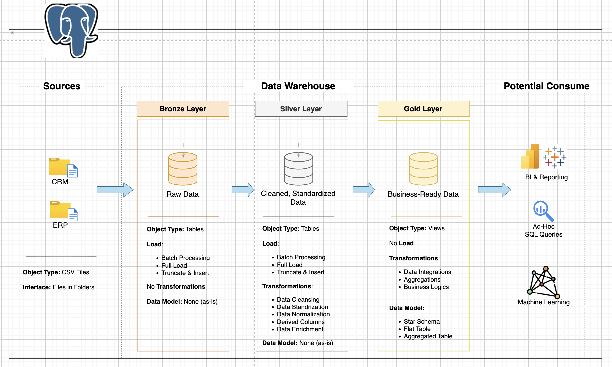
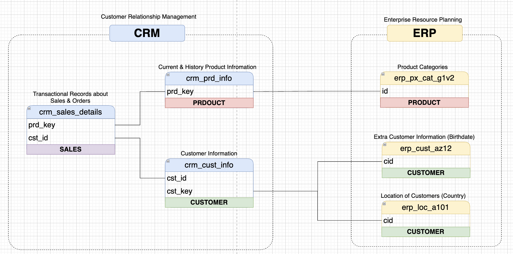
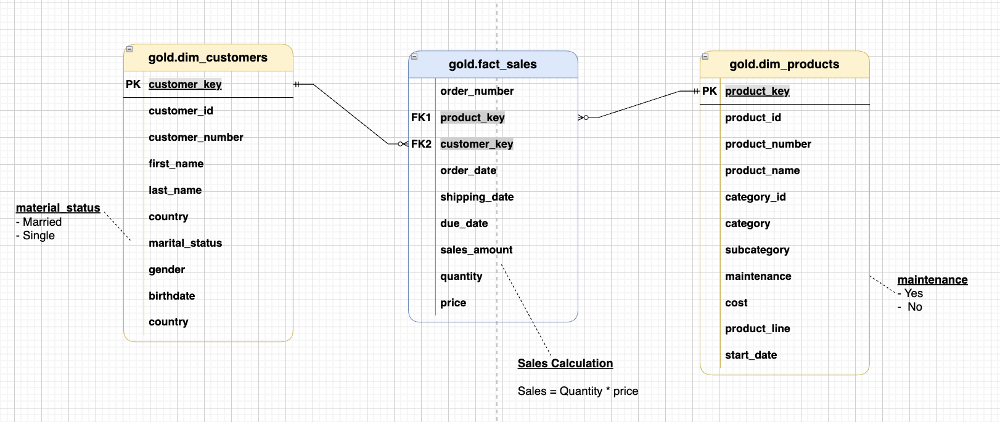

# Data Transformation Portfolio: Traditional SQL vs dbt

This project implements the same analytics-ready data model in two ways:

1. `traditional_data_model/`: procedural SQL (stored procedures + manual orchestration)
2. `dbt_data_model/`: modular dbt project (models, tests, macros, lineage)

The goal is to demonstrate both foundational SQL engineering and modern analytics engineering, then compare the tradeoffs with the same business domain and source data.

## Why This Project

Most teams are not purely legacy or purely modern. Real data engineering work often means:

- maintaining existing SQL pipelines,
- designing clean dimensional models,
- and migrating to more maintainable frameworks like dbt.

This repository shows that full path end-to-end: from raw ingestion to a star schema in both implementations.

## What Problem Is Being Solved

Two source systems (CRM + ERP) are integrated into a unified analytical model:

- CRM: customers, products, sales transactions
- ERP: demographics, locations, product categories

Target output: a Gold-layer star schema for BI and analysis.

## Architecture

### Medallion Flow (Traditional SQL)





### Gold-Layer Star Schema (dbt)



## Repository Structure

```text
sql_data_model/
├── README.md
├── traditional_data_model/
│   ├── scripts/
│   │   ├── bronze/
│   │   ├── silver/
│   │   └── gold/
│   ├── tests/
│   ├── datasets/
│   ├── images/
│   └── Architecture_Design/
└── dbt_data_model/
    ├── models/
    │   ├── bronze/
    │   ├── silver/
    │   └── gold/
    ├── macros/
    ├── tests/
    ├── packages.yml
    └── dbt_project.yml
```

## Implementation 1: Traditional SQL (Procedural)

Path: `traditional_data_model/`

### Approach

- Ingestion via `COPY` from CSV into Bronze tables
- Cleansing and standardization in Silver via `plpgsql`
- Final business entities in Gold views (`dim_customers`, `dim_products`, `fact_sales`)
- Validation through manual SQL quality-check scripts

### Highlights

- Dynamic table creation procedure: `scripts/bronze/Schema_Tables_Create.sql`
- Layer orchestration procedures:
  - `scripts/bronze/Load_Bronze.sql`
  - `scripts/silver/Load_Silver.sql`
- Gold star-schema views: `scripts/gold/Load_Gold.sql`
- Manual data-quality checks:
  - `tests/quality_checks_silver.sql`
  - `tests/quality_checks_gold.sql`

### Skills Demonstrated

- procedural ETL in SQL,
- data cleansing rules (dedupe, code standardization, date parsing),
- dimensional modeling with surrogate keys,
- referential integrity validation by query.

## Implementation 2: dbt (Modern Analytics Engineering)

Path: `dbt_data_model/`

### Approach

- Raw-to-gold transformations as versioned dbt models
- Reusable macros for standardization and calculations
- Built-in testing/documentation configuration in model YAML
- Incremental models for transaction-heavy layers

### Highlights

- Layered models: Bronze (6), Silver (6), Gold (4)
- Incremental models:
  - `models/bronze/bronze_crm_sales_details.sql`
  - `models/silver/silver_crm_sales.sql`
- Reusable macros:
  - `macros/data_transformations.sql`
  - `macros/audit_helpers.sql`
- Quality tests include:
  - uniqueness + not-null,
  - accepted values,
  - range checks via `dbt_expectations`,
  - relationship tests in Gold.

### Skills Demonstrated

- dbt project design and model layering,
- SQL modularization through macros,
- analytics engineering testing patterns,
- metadata-driven documentation and lineage-ready modeling.

## Side-by-Side Comparison

| Area | Traditional SQL | dbt |
|---|---|---|
| Orchestration | Manual run order | Dependency graph (`ref`) |
| Reuse | Copy/paste or procedures | Macros + model contracts |
| Testing | Manual SQL checks | Automated schema/data tests |
| Lineage/Docs | External/manual | Generated from project metadata |
| Change Management | SQL scripts in DB context | Git-native, code-first workflow |
| Scalability of Team Practices | Lower | Higher |

## Dataset and Scope

- Input CSV rows in repo: `116,297`
- Scope: current-state transformations (no historized warehouse in traditional flow)
- Focus: data modeling and transformation quality over ingestion platform complexity

## How to Run

### Traditional SQL Flow

1. Create schemas and base tables (Bronze/Silver/Gold).
2. Run load procedures in order.
3. Run quality checks.

Example (PostgreSQL):

```sql
CALL create_dw_tables('bronze');
CALL create_dw_tables('silver');
CALL create_dw_tables('gold');

CALL bronze.load_bronze();
CALL silver.load_silver();

-- create/recreate Gold views
\i traditional_data_model/scripts/gold/Load_Gold.sql

-- validation
\i traditional_data_model/tests/quality_checks_silver.sql
\i traditional_data_model/tests/quality_checks_gold.sql
```

### dbt Flow

```bash
cd dbt_data_model
pip install dbt-postgres
dbt deps
dbt debug
dbt run
dbt test
dbt docs generate
dbt docs serve
```

## Design Standards and Documentation

- Naming conventions: `traditional_data_model/images/naming_conventions.md`
- Gold-layer data catalog: `traditional_data_model/images/data_catalog.md`
- Detailed approach docs:
  - `traditional_data_model/README.md`
  - `dbt_data_model/README.md`

## What This Shows About My Engineering Approach

- I can build reliable transformations with raw SQL and procedural control.
- I can implement the same logic in dbt using modular, testable patterns.
- I understand not just *how* to build pipelines, but *why* architecture choices matter for team velocity, maintainability, and analytics trust.

## License

MIT License (`LICENSE`).
